# Finale Inventory Transfer Automation - System Flowchart

## Main Application Flow

---

## Batch Execution Control Flow

---

## Finale App Screen Navigation

---

## System Architecture

---

## Quick Scripts Flow

---

## Data Flow

```mermaid
flowchart LR
    Excel[📄 Excel File<br/>.xlsx] -->|Upload| Server[🖥️ Flask]
    Server -->|Parse| Data[FROM, TO, IMEIs]
    Data -->|Store| Pending[Pending Batch]
    Pending -->|Execute| ADB[📱 ADB]
    ADB -->|Type| Finale[Finale App]
    
    TXT[📄 receive.txt] -->|Read| Script[🐍 Python Script]
    Script -->|Type| ADB

    style Excel fill:#217346,color:#fff
    style TXT fill:#FFD700,color:#000
    style Finale fill:#FF5722,color:#fff
```

---

## Key Coordinates (2400x1080 Landscape)

| Element | X | Y |
|---------|---|---|
| Back/Clear Button | 120 | 950 |
| Enter Button | 390 | 950 |
| More/Menu Button | 660 | 950 |
| Menu Item 1 | 400 | 185 |
| Menu Item 2 | 400 | 280 |
| Menu Item 3 | 400 | 375 |
| Menu Item 4 | 400 | 470 |
| Confirm Dialog - Back | 245 | 580 |
| Confirm Dialog - Confirm | 1310 | 580 |

---

*Generated for Project Manager presentation*

